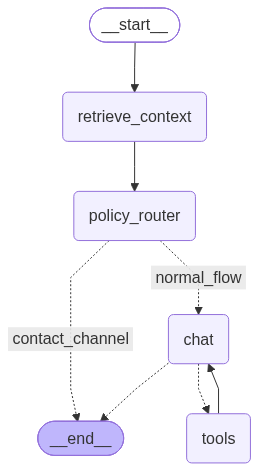

## Arquitectura propuesta y justificación



Elegí este diseño porque prioriza una arquitectura simple pero extensible para un asistente de soporte con RAG, guardrails y evaluación automática utilizando pytest y langsmith evaluators (LLM as Judge).

Dividí el sistema en capas:

- retrieval para recuperar contexto desde los documentos
- policy/guardrail routing para decidir si el usuario debe seguir el flujo normal o ser derivado a un humano
- chat node para responder en el flujo normal
- tools para consultar pedidos y recuperar canales de contacto

**Guardrail (LLM)**:
Hubiera sido posible codificar reglas exactas para todos los casos, pero elegí que el router use el contexto recuperado.

Trade-off:
ventaja: más flexible ante cambios en la KB, razonamiento de casos no tan explicitos en la kb.
desventaja: más sensibilidad a cómo el modelo interpreta el prompt, coste por tener una llamada extra al LLM.

**Endpoint para la actualizacion de la base de datos**:
La actualización del índice por API fue pensada como una operación directa.

Trade-off:
ventaja: rápida de usar y simple
desventaja: definitivamente generara un bloqueo si la cantidad de documentos crece mucho

## Decisiones técnicas de RAG
- Chunking: 
    No apliqué chunking explícito a estos documentos porque el contenido de los archivos es pequeño y contienen políticas cortas. En este caso, mantener cada documento completo simplifica la recuperación y evita perder contexto importante entre reglas relacionadas.

    Si la base de conocimiento creciera a miles de documentos, sí aplicaría chunking con:

    división por encabezados/secciones semánticas
    solapamiento moderado para no perder contexto
    metadatos por fuente, tipo de política y fecha

    En ese escenario también usaría una estrategia híbrida:

    chunking semántico
    indexación incremental
    recuperación por top-k con re-ranking si fuera necesario
    o inclusive una arquitectura RAG Agentica

- Embeddings: ¿qué modelo de embeddings usaste y por qué?
    Usé text-embedding-3-small como modelo de embeddings, porque es ligero y eficiente, lo que ayuda en un proyecto pequeño, permite mantener el sistema más simple y rápido, sin necesidad de un modelo más costoso.

- Threshold de recuperación: 
    No usé un umbral fijo de similitud debido a que los documentos son pocos en cantidad y tamaño y no se esta aplicando estrategias de chunk; en su lugar, usé recuperación por top-k y actualmente el retriever devuelve los 2 documentos más cercanos. Esto simplifica el flujo y asegura que el guardrail y el chat reciban contexto suficiente para decidir.

    Si ningún documento es realmente relevante, el comportamiento depende del nodo guardrail:

    el guardrail debe seguir el flujo normal si el contexto recuperado no contiene una instrucción explícita de atención humana y el nodo chat debe indicar que no encontró suficiente información.

## Pruebas automatizadas
Los test validan diversos escenarios de aplicación para la redacción de la respuesta, incluyendo:

- respuestas directas desde la base documental
- respuestas con redirección a canal humano
- consultas de estado de pedido encontrado y no encontrado
- variaciones de redacción que conservan el núcleo semántico de la respuesta

Se implementaron pytest y LangSmith evaluators con LLM as judge porque el proyecto no solo necesita comprobar que el código “corre”, sino evaluar si el asistente responde correctamente en términos semánticos y funcionales.

* Pytest

    La utilizacion de PyTest para la evaluacion de casos de prueba es un requerimiento de la prueba, se evualo que el contenido de la respuesta tuviera palabras clave y se puede ejecutar con el comando 
    ``` 
    pytest .\tests\pytests\test_cases.py  
    ```

* Langsmith (llm as judge)

    Porque el sistema se enfoca en poder tener una plataforma para priorizar la trazabilidad e investigacion de los resultados. Implemente LLM as judge para poder validar la corrección semántica y el groundness. ejecuta con el siguiente commando. (Al estar integrado con Langsmith/Langchain la API KEY en .env es mandatoria para ejecutar estas pruebas)
    ```
    python .\tests\llm_as_judge\test_cases.py 
    ```


## Cómo mapearías esto a producción
- **Consumo del modelo desacoplado con Kafka**

    Desacoplamiento del consumo del agente, utilizaria dos topicos principales chat-inbund para obtener la solicitud del cliente, el consumer se encargaria de generar la respuesta consumiendo el modelo manejando sesiones, el topico chat-outbound con la respuesta generada del agente para se consumida para la interfaz del cliente.

- **Foundry como runtime de IA**

    Los modelos ya se consumen desde Azure Foundry

- **RAG corporativo en Databricks/Unity Catalog**

    La migracion completa de la base vectorial local acutal (FAISS), para poder consumir desde Unity Catalog si 
    se encuentra disponible Vector Search, en otro caso dependiendo del alojamiento del modelo podria considerarse
    Azure AI Search para la latencia si los agentes son alojados en la infraestructura de azure.

- **Apigee como API gateway**

    La exposición del agente pasaría por Apigee para manejar seguridad, autenticación, autorización, rate limiting y gobierno de la API.

## Limitaciones conocidas
Hoy el sistema está más cerca de un asistente de una sola pregunta que de un agente conversacional completo.

- no mantiene memoria ni sesión
- no soporta conversaciones multi-turno
- no fue probado a fondo en escenarios de diálogo prolongado
- No medir consumo por usuario, sesión o rastrea costos por modelo y por flujo.
- La interfaz API es básica.
- Mejorar documentación.

## Tiempo invertido
8 - 10 Horas